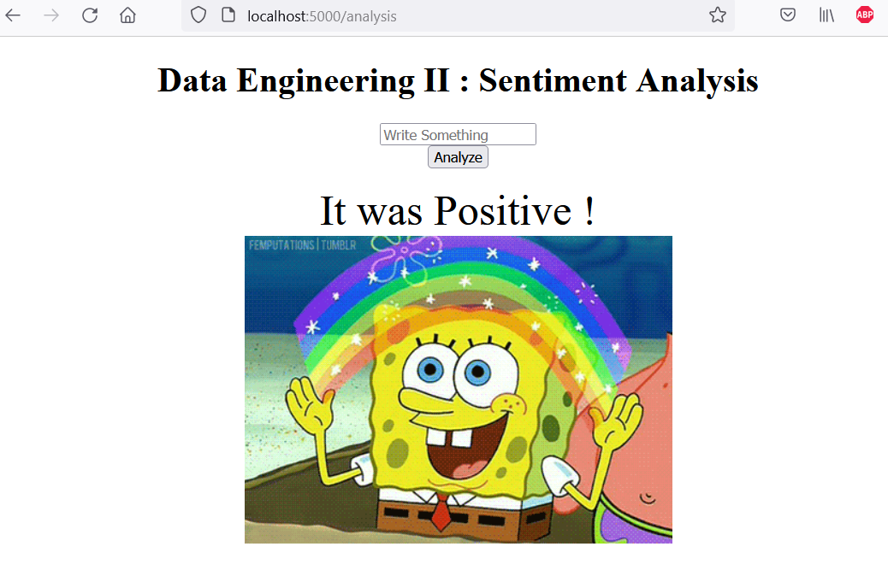
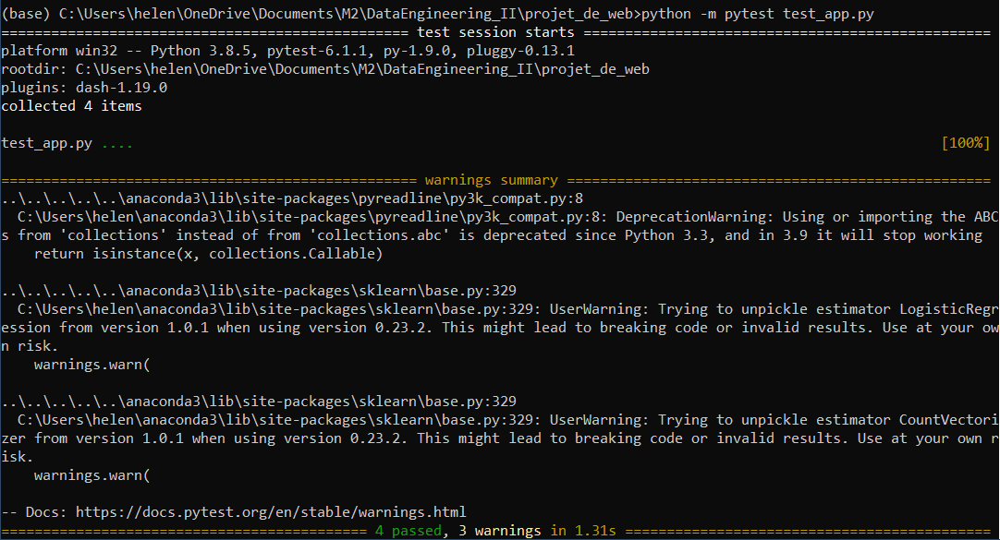

Boersma Hélène, Gonnot Vianney et Gueuret Elodie
# Data_engeneeringII
Project Summary

As a part of the curriculum of the Master 2 (M2) course entitled “Data Engineering II”, the students will complete a team project work. Each team is composed of 3 members, and the members will take care of dividing the tasks equally between them. The purpose of this project is to combine all the skills collected throughout the course thus far, and to provide a solid example of real-life application development in a DevOps environment.

The following sections provide necessary information about the description of the application to be created.

For any further detail, please contact the instructor: Khodor Hammoud.

# 1. User Stories

· The application is a sentiment analysis application, which, given a piece of text, should be able to reply with its sentiment as being positive, negative, or neutral.

· The text language used must be English

· The application should have a web interface with an input form and a submit button, where users can input their sentences, and hit submit, and the sentiment of their sentence will be presented.

· The accuracy of the sentiment analyzer should be above 80%

· The application must be easily deployable

# 2. Application Overview


# 3. Technical Description

# 3.1 The ML Model

The students are free to choose whichever machine-learning model they want, and whichever dataset they please (as long as it is in English, as this is a user requirement). The end product should have the model ready and pre-trained, with the requested minimum accuracy.

# 3.2 The Web Interface

The students are free to choose whichever technology they know/like to create the web insterface. The end result should be a running application which the end user can access through a web browser, and start using immediately.

In order to run the application we need to build the app with this command line :

```
docker-compose build
```

and then :

```
docker-compose up
```

The App is running on : "localhost:5000"

How our web interface looks like : 

<p align="center">
  
</p>

# 3.3 The Application Package

The final format of the application ready for distribution should be a Docker Image, which administrators can simply run Containers from. Students should provide a description file with their submitted application in which whey describe how to run their image (like providing on which port does the application run by default…)

# 4. Technical Requirements

The students are to use the following technologies and steps throughout their implementation:

# 4.1 Task Management

Each team is to use a project management tool of their choice (Trello, Asana, Jira…) to coordinate the tasks between the team members. Divide the user stories into tasks, list these tasks on the project manager, and track the progress of each task as it progresses. Each team is required to present their project management history during their presentation.

# 4.2 Source Code Management

Each team is required to create a github repository containing their project, and use it as their version control. Each new task should have its own branch on the github repository. At every task completion (from the project manager), the associated team member should merge their task’s branch to the master branch. The github repository should contain all your files, including the docker file and any meta data files (like the python requirements.txt if it exists).

# 4.3 Testing

Each team should provide unit and integration tests to their final application. Unit tests are in the form of testing the functionality of each function of your program (when applicable), and the integration testing will be testing the entire system integrated.

We run 4 tests with pytest : 

<p align="center">
  
</p>

In order to make the unit tests, we need to start our application. After that, just run this command line :

```
python -m pytest unit_test_app.py
```


# 4.4 Containarization

The final application deliverable should be a Docker image, that contains the pre-trained model as well as the application web interface. Running a container off the delivered image should allow users to view a web interface on their browser and be able to immediately start running predictions.


How pull the image :
```
docker pull vianneygonnot/data_engeneeringii_web:lastest
```

# 5. Trello for project 

https://trello.com/b/zgZqVp0I/project-data-engeneering


